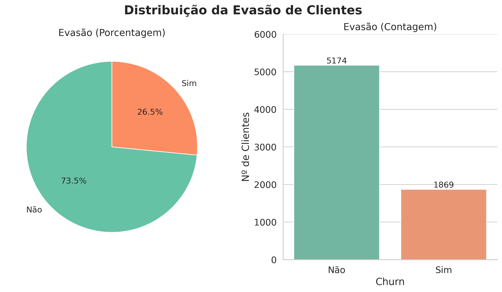
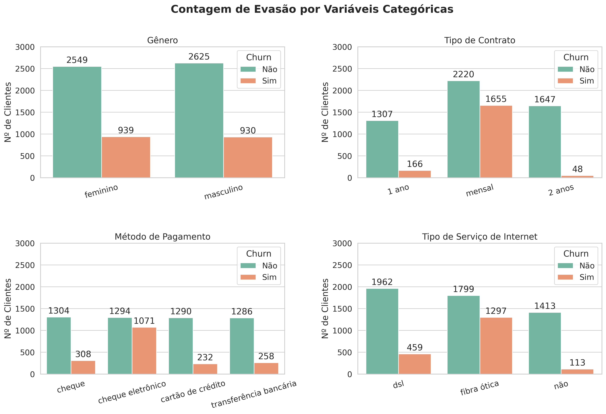
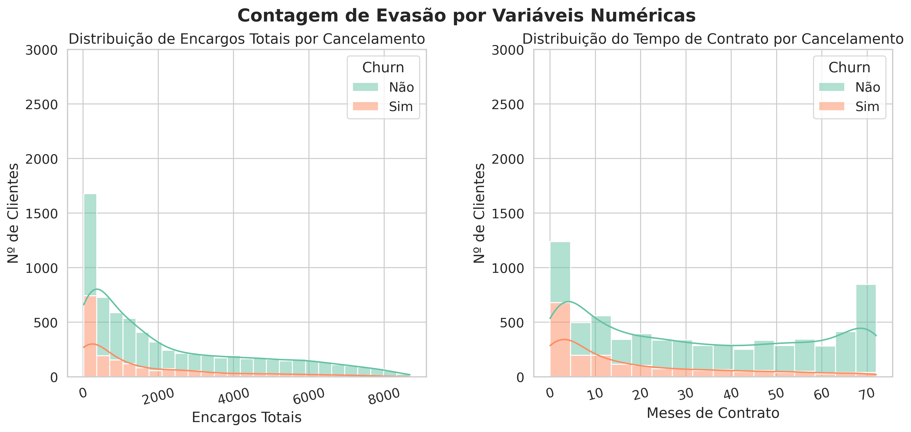

# Challenge ONE Data Science: Telecom X - Análise de Evasão de Clientes

[](https://www.python.org/)
[](https://jupyter.org/)
[](https://colab.research.google.com/github/rodrigosergiosilva/challenge-telecom-x/blob/main/TelecomX_BR.ipynb)
[]()
[](LICENSE)

Seja bem-vindo ao desafio da Telecom X - Análise de Evasão de Clientes !

Este projeto tem como como objetivo analisar a **evasão de clientes (Churn)** da empresa **Telecom X**, identificando padrões e fatores que contribuem para a saída dos usuários. A compreensão desses elementos é crucial para o desenvolvimento de estratégias eficazes de retenção de clientes e para a melhoria contínua dos serviços oferecidos.

---

## 🎯 Propósito da Análise

Os dados brutos, fornecidos em formato JSON, apresentavam uma estrutura aninhada que necessitou ser normalizada para facilitar a análise. Após o tratamento dos dados os principais pontos avaliados foram:

- Distribuição da Evasão
- Contagem de Evasão por Variáveis Categóricas
- Contagem de Evasão por Variáveis Numéricas 
- Taxa de Churn por Meses de Contrato  
- Meses de Contrato vs. Gasto Mensal por Churn

Através da utilização do Python e suas principais bibliotecas foi possível extrair insights valiosos. A partir desta análise, será possível avançar para modelos preditivos e desenvolver estratégias para reduzir a evasão.

---

## 🗂 Estrutura do Projeto

```
📁 challenge-telecom-x/
│
├── 📁 dados/                     # Arquivo CSV com dados de evasão de clientes
│   ├── TelecomX_Data.json 
├── 📁 imagens/                   # Gráficos gerados durante a análise
│   ├── contagem_evasao_por_variaveis_categoricas.png
│   ├── contagem_evasao_por_variaveis_numericas.png
│   └── distribuicao_evasao.png
│   └── meses_contrato_vs_gasto_mensal_por_churn.png
│   └── taxa_churn_por_meses_contrato.png
├── 📄 TelecomX_BR.ipynb          # Notebook principal com toda a análise
├── 📄 LICENSE
├── 📄 README.md                  # Este arquivo
```
---

## 📊 Exemplos de Gráficos e Insights

Durante a análise, foram criadas diversas visualizações. Aqui estão alguns exemplos:

### 📉 Distribuição da Evasão

- A taxa de evasão é de aproximadamente **26.5%**.



### 🗂️ Contagem de Evasão por Variáveis Categóricas

A análise das variáveis categóricas revelou insights sobre quais grupos de clientes têm maior probabilidade de evadir.

**Gênero**: A evasão é relativamente equilibrada entre os gêneros.

**Tipo de Contrato**: Clientes com contrato mensal apresentam uma taxa de evasão significativamente maior em comparação com contratos de 1 ou 2 anos.

**Forma de Pagamento**: O método de pagamento cheque eletrônico está associado a uma maior taxa de evasão.

**Tipo de Serviço de Internet**: Clientes com serviço de internet fibra ótica parecem ter uma taxa de evasão maior do que aqueles com DSL ou sem serviço de internet.



### 🔢 Contagem de Evasão por Variáveis Numéricas

A análise das variáveis numéricas em relação à evasão forneceu uma perspectiva sobre como o tempo de contrato e o gasto total influenciam a decisão do cliente de permanecer ou sair.

**Gasto Total**: Clientes que evadiram tendem a ter um gasto total menor.

**Meses de Contrato**: A maioria dos clientes que evadiram tinha um tempo de contrato menor.



---

## ✅ Conclusão

Com base nas análises realizadas, podemos destacar os seguintes pontos:

- A taxa geral de evasão da Telecom X é de 26.5%, o que indica um desafio significativo de retenção.
- Clientes com contratos mensais e que utilizam cheque eletrônico como forma de pagamento apresentam maior propensão à evasão.
- O tempo de contrato é um fator crucial: clientes com menos tempo de permanência têm maior probabilidade de evadir.
- Clientes com serviço de internet fibra ótica mostram uma taxa de evasão mais alta.
- Clientes que evadiram tendem a ter um gasto total menor.

Esses insights sugerem que a empresa deve focar seus esforços de retenção nos clientes com contratos de curto prazo, especialmente aqueles com serviço de fibra ótica e que utilizam cheque eletrônico.

---

## 🚀 Como Executar o Notebook

1. Tenha o **Python 3.10 ou superior** instalado.
2. (Opcional) Crie um ambiente virtual:
   ```bash
   python -m venv venv
   source venv/bin/activate  # No Windows: venv\Scripts\activate
   ```
3. Instale as dependências:
   ```bash
   pip install pandas matplotlib jupyter
   ```
4. Clone este repositório:
   ```bash
   git clone https://github.com/rodrigosergiosilva/challenge-telecom-x.git
   cd challenge-telecom-x
   ```
5. Execute o Jupyter Notebook:
   ```bash
   jupyter notebook TelecomX_BR.ipynb
   ```

Ou acesse diretamente no Google Colab:  
[](https://colab.research.google.com/github/rodrigosergiosilva/challenge-telecom-x/blob/main/TelecomX_BR.ipynb)

---
## 📄 Licença

Este projeto está licenciado sob os termos da [](LICENSE).  
Sinta-se livre para usar, modificar e distribuir com os devidos créditos.

---

## 📬 Contato

[](https://www.linkedin.com/in/rodrigo-sergio-silva/)

Fique à vontade para abrir uma **issue** ou enviar uma **pull request** com sugestões ou melhorias! 😄
